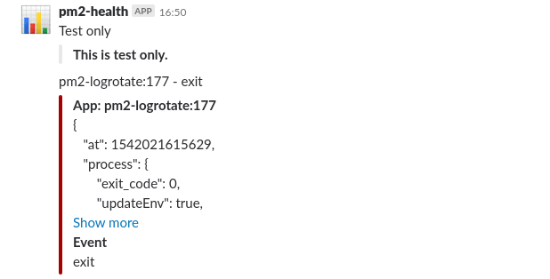

# pm2-health
This [PM2](http://pm2.keymetrics.io/) module is:
* Monitoring events (like app exit, restart etc.)
* Monitoring app exceptions
* Monitoring PMX metrics of your apps and send alerts when value hits treshold
* Sending mail notifications

With rich config options you can fine-tune monitoring rules.

## Installation & Upgrade

`pm2 install pm2-health`

## Configuration

After installation run `pm2 conf` to configure module. Alternatively edit `module_conf.json` file directly (in PM2 home folder).

### Minimum required config:

```json
"pm2-health": {
    "smtp": {
        "host": "your-smtp-host",
        "port": 587,
        "from": "your-from-mail", // if not set, user will be used
        "user": "your-smtp-user",   // auth
        "password": "your-smtp-password",   // auth
        "secure": false,
        "disabled": false
    },
    "mailTo": "mail1,mail2"
}
```
> If any of required properties is not defined, `pm2-health` will shutdown. You can check error logs for details.

### All config options:

* `smtp` - SMTP server configuration. If your SMTP doesn't require auth, leave `smtp.user` empty

* `mailTo` - comma separated list of notification receipients

* `replyTo` - reply to address (optional)

* `slack` - Slack conf : channel and webhook are required to use this

* `events` - list of events to monitor (optional). If not set, all events will be monitored. 

> Manually triggered events will not send notification.

* `exceptions` - if `true` apps exceptions will be monitored (optional)

* `messages` - if `true` apps custom messages will be monitored (optional). See [Custom messages](#custom-messages)

* `messageExcludeExps` - list of regular expressions used to exclude messages (optional). See [Filtering custom messages](#filtering-custom-messages)

* `metric` - object describing PMX metrics to be monitored (optional). See [Metrics monitoring](#metrics-monitoring)

* `metricIntervalS` - how often PMX metrics will be tested in seconds (optional). If not set, 60 seconds is used

* `aliveTimeoutS` - alive watchdog timeout interal in seconds. If not set watchdog function is off. See [Process alive watchdog](#process-alive-watchdog)

* `addLogs` - if `true` app logs will be added as mail attachement (optional)

* `appsExcluded` - list of app names to exclude from monitoring (optional)

* `webConfig` - if set, some of the config settings can be downloaded from given url (optional). See [Web config](#web-config)

## Metrics monitoring

`pm2-health` can monitor any PMX metrics defined in your apps.

To configure rules of alerting, setup `metric` section in module config file.

```json
"metric": {
    "metric name": {
        "target": 0,
        "op": ">",
        "ifChanged": true,
        "noNotify": true,
        "noHistory": true,
        "exclude": false
    },
    "metric 2": {
        ...
    }    
}
```
* `metric name` - name of metric defined in one of your apps

* `target` - target numeric value

* `op` - operator to compare metric value and target. Can be one of: `<`, `>`, `=`, `<=`, `>=`, `!=`

* `ifChanged` - if `true`, alert will trigger only if current metric value is different from last recorded value (optional)

* `noNotify` - if `true`, no alerts will be send (optional)

* `noHistory` - if `true`, metric value history won't be stored (optional)

* `exclude` - if `true`, metric will be complettely excluded from monitoring (optional)

* `direct` - if `true`, metric value won't be converted to number (optional)

By default, `cpu` and `memory` metrics are added.

> Learn how to define PMX metrics in your apps here: http://pm2.keymetrics.io/docs/usage/process-metrics/

## Custom messages

On top of standard PM2 events, you can monitor custom messages sent from your apps.

To send message from your app use:
```javascript
process.send({
    type: "process:msg",    
    data: {    
        ...
    }
});
```

* `type` - must be `process:msg`

* `data` - object containing additional data (optional).

### Filtering custom messages
You can exclude some of the messages based on their `data` content:

1. Add regular expression to list in `messageExcludeExp` config property
1. `data` (converted to JSON string) will be tested with this all expressions in the list
1. If any test is positive, message will be excluded

Example:

You wish to monitor slow operations in your app, so you send custom messages like so:
```javascript
function slow(operation, duration) {
    process.send({ type: "process:msg", data: { operation, duration }});
}
```
You know that `backup` and `restore` operations are always slow and wish to exclude them, but still get other slow operations.

Set config to:
```json
"messageExcludeExps": [
    "\"operation\": \"(backup|restore)\""
]
```
> Remember to escape regex string to JSON string

## Process alive watchdog

Alive watchdog (added in 1.9.0) can observe alive messages from processes.

To use functionallity your process has to send periodically `process:msg` signal as such:
```javascript
process.send({
    type: "process:msg",    
    data: "alive"
});
```

In addition config parameter `aliveTimeoutS` must be added. If alive message won't be received within `aliveTimeoutS` (seconds), alert will be send.

> `aliveTimeoutS` must be lower than interval of sending `process:alive` signal.

After first alert, following test is done every 10 minues for 6 consecutive times, after wich alerting stops, assuming process is permanetly closed.


## Web config

Web config (added in 1.7.0) allows you to fetch some of the config settings from web url.

Sample config:

```json
{
    "webConfig": {
        "url": "url of JSON file",
        "auth": {
            "user": "...",
            "password": "..."
        },
        "fetchIntervalM": 10
    }
}
```

Url must return UTF-8 JSON with config properties.

> Only following properties can be used: `events`, `metric`, `exceptions`, `messages`, `messageExcludeExps`, `appsExcluded`, `metricIntervalS`, `addLogs`

## Hold notifications temporarily

To hold mail/slack notification: `pm2 trigger pm2-health hold 30`

> Notifications will restart automatically after 30 minutes.

To unhold immediatelly: `pm2 trigger pm2-health unheld`

> All monitoring processes continues, just mail/slack notification is held

## Mail template

Mail uses HTML format. To adjust template, you can edit [Template.html](./Template.html)

`<!-- body -->` will be exchanged with actual message body.

`<!-- timeStamp -->` will be exchanged with event timestamp (UTC).

> `pm2-health` update will override your `Template.html`, so keep backup :blush:

## Testing mail

To send test mail: `pm2 trigger pm2-health mail`

## Slack Messages

Slack uses the incoming webhooks message builder.



## Testing slack

To send test slack message: `pm2 trigger pm2-health slack`

## Building

`pm2-health` is written using TypeScript 2.6.1+ with `es2017` target. 

`es2017` is supported by Node 8+. If you need to use ealier version, build solution using `es5` or `es6` target.

> Solution includes VS Code settings for build and debug.